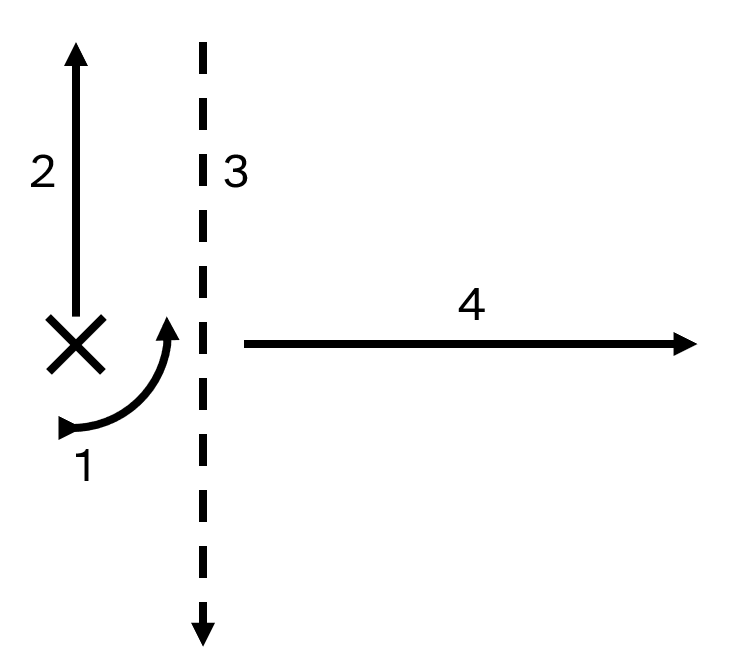

# Barrage Frag

A barrage frag is a fragment that has the effect of creating a barrage of bullets that look like they were shot from an artillery line.

This chapter contains a description of the barrage frag in addition to a way of achieving the same effect using [`barrelSpacing`](./turreted_weapons.html?highlight=barrelSpacing#barrel-appearance).

The barrage frag has four core stages. Their purposes are as follows:
1. Rotate the fragment 90° counterclockwise.
2. Almost instantly travel some distance left.
3. Almost instantly travel a random distance in between no distance and double the distance travelled from the point of firing, using `rangeStdDev` to do so. This stage also has a greater-than-one `roundsPerBurst` to make a more bullet dense artillery barrage effect.
4. The actual, visible bullet, now fired along a line.



```lua
{ 17000
    features=CANNON
    cannon={   damage= 1 muzzleVel=  500 range= 50                 color=1          spread= 90*pi/180 pattern=CONSTANT explosive=FINAL              roundsPerSec= 30 power=10 recoil=0
    fragment={ damage= 1 muzzleVel=-1000 range=-100 rangeStdDev=50 color=1                                             explosive=FINAL|FRAG_NOFLASH roundsPerBurst=5
    fragment={ damage= 1 muzzleVel= -500 range=  0                 color=1                                             explosive=FINAL|FRAG_NOFLASH
	fragment={ damage=25 muzzleVel=  500 range=200  rangeStdDev=10 color=0xAAFFFFFF spread=-90*pi/180 pattern=CONSTANT explosive=      FRAG_NOFLASH
	}}}}
}
```

<video height=256 controls>
  <source src="diagrams/frag_barrage.mp4" type="video/mp4">
  Your browser does not support the video tag.
</video>

## Y-Spaced Barrel Method: Y-Spaced Barrel Barrage (YSBB)

A similar effect can be created by using the Y part of the `barrelSpacing` field.

The primary stage has a high `roundsPerSec` so that the cannon cycles through its barrels rapidly. It also has a high `roundsPerBurst` and `burstyness` to avoid the tapping of the fire button causing only a few of the barrels to be shot out of. This stage also has a small `range` and `rangeStdDev` with a relatively high `muzzleVel` to add variation to when the secondary stage appears, making the barrage look more random.

The secondary stage is the actual bullet. Even though its `muzzleVel` is 460, it will actually travel at the speed of 500 because of what it inherits from the primary stage.

```lua
{ 17000
	features=CANNON|TURRET|
	barrelSize={0.000001,0.000001}
	barrelCount=32
	barrelSpacing={0,5}
	cannon={
		roundsPerSec=120
		roundsPerBurst=32
		burstyness=0.9
		damage=1
		muzzleVel= 40
		range=      4
		rangeStdDev=4
		color=1
		explosive=FINAL
		recoil=0
		fragment={
			damage=25
			muzzleVel=460
			range=    460
			color=0xFFFFFFFF
		}
	}
}
```

<video height=256 controls>
  <source src="diagrams/y-spaced_barrel_barrage.mp4" type="video/mp4">
  Your browser does not support the video tag.
</video>

Compared to the frag barrage, the YSBB is more consistent, not being concentrated at the center due to the use of `rangeStdDev` and the [standard deviation curve](./standard_deviation_fields.md).

A disadvantage of the YSBB compared to the frag barrage is that the YSBB relies on utilising a turreted block, and thus cannot work anywhere but the start of a fragment.