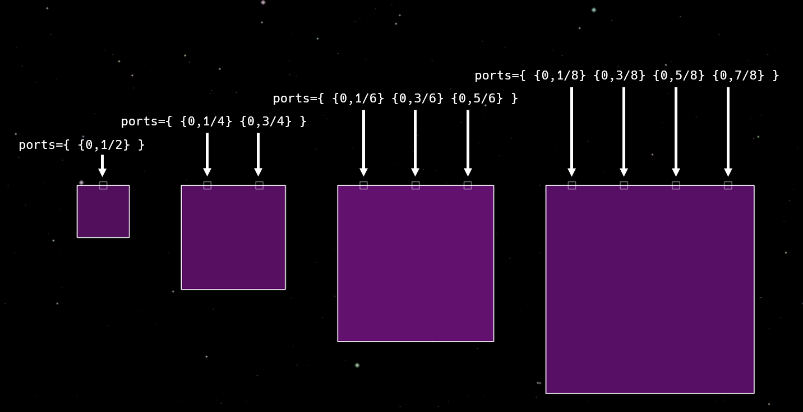
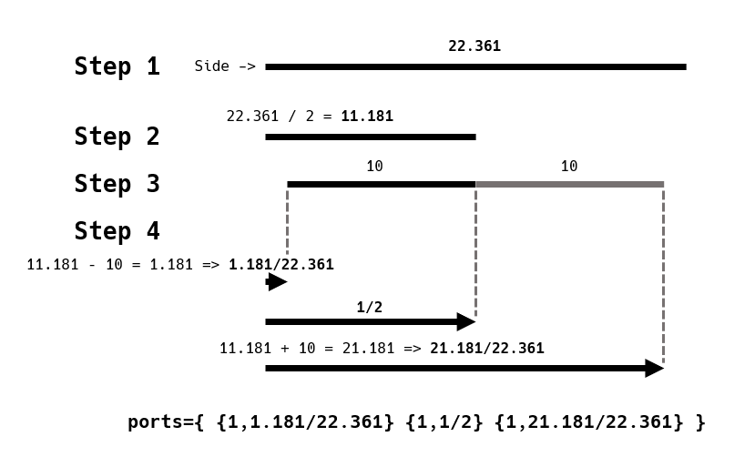
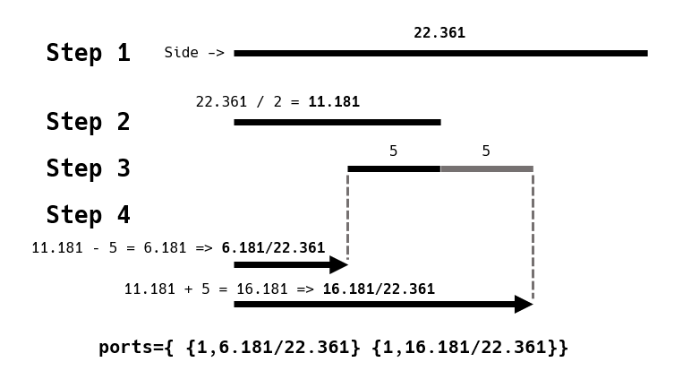

# Calculating Port Positions

Calculating port positions for rationally lengthed sides (i.e.: whole number-lengthed sides) is fairly simple. The example below of different scales of squares can help you intuit it:



Using fractions makes calculating ports for rational sides easy and makes copying them for larger scales simpler. However, irrationally lengthed sides, so as those of hypotenuses, are more complicated.

> Fraction = Numerator / Denominator.

> Port position = position of port in Reassembly units / length of side in Reassembly units.

If you want to get the port position of any side, you must calculate the length of the side in Reassembly units:

\\( \text{Side Length} = \sqrt{(x_2 - x_1)^2 + (y_2 - y_1)^2} \\)

Here's how you would calculate the irrational hypotenuse of a 1x2 right triangle with the vertices defined below:

```lua
        verts={ {-10,-5} {-10,5} {10,-5} }
```

<video height=400 controls>
  <source src="diagrams/calculating_side_length.mp4" type="video/mp4">
  Your browser does not support the video tag.
</video>

You could also use this program to calculate it (you can edit and run it in this guide):
```rust,editable
fn main() {
    let x1: f32 = -10.0;
    let y1: f32 = 5.0;
    let x2: f32 = 10.0;
    let y2: f32 = -5.0;

    let side_length = ((x1 - x2).powi(2) + (y1 - y2).powi(2)).sqrt();

    print!("{:.3}", side_length);
}
```

Next, find the positions of your ports in Reassembly units. Depending on the shape, you will need to calculate this differently. Here are some examples for shapes with odd and even numbers of ports on one side:

## Odd (3 Ports)

(This shape should really only have two ports on this side, but I won't judge it because it's an example.)



```lua
        verts={ {-10,-5} {-10,5} {10,-5} }
        ports={ {1,1.181/22.361} {1,1/2} {1,21.181/22.361} }
```

<video height=256 controls>
  <source src="diagrams/shapes_odd.mp4" type="video/mp4">
  Your browser does not support the video tag.
</video>

## Even (2 Ports)



```lua
        verts={ {-10,-5} {-10,5} {10,-5} }
        ports={ {1,6.181/22.361} {1,16.181/22.361} }
```

<video height=256 controls>
  <source src="diagrams/shapes_even.mp4" type="video/mp4">
  Your browser does not support the video tag.
</video>

## A program to do it for you.

If you understand how to calculate port positions intuitively, then you can use a program to make it less tedious.

Edit the values `side_index`, `x1`, `y1`, `x2`, `y2`, `port_spacing` to get your specific values.

Optionally, change the corresponding `true` to `false` to edit `port_count` and `port_flags`.

```rust,editable
fn main() {
    let side_index: usize = 0;

    let x1: f32 = -10.0;
    let y1: f32 = 5.0;
    let x2: f32 = 10.0;
    let y2: f32 = -5.0;

    let port_spacing: f32 = 10.0;

    let side_length = ((x1 - x2).powi(2) + (y1 - y2).powi(2)).sqrt();

    let port_count: usize = if true {
        (side_length / port_spacing).floor() as usize
    } else {
        3 // To set your own value here, replace `true` with `false`.
    };

    let port_flags: &str = if true {
        ""
    } else {
        ",LAUNCHER" // To set your own value here, replace `true` with `false`.
    };

    print!("ports={{ ");

    for port_index in 0..port_count {
        let port_distance = side_length * 0.5
            - port_spacing * (port_count - 1) as f32 * 0.5
            + port_spacing * port_index as f32;
        let port_position = format!("{}/{}", port_distance, side_length);
        print!("{{{},{}{}}} ", side_index, port_position, port_flags);
    }

    print!("}}");
}
```