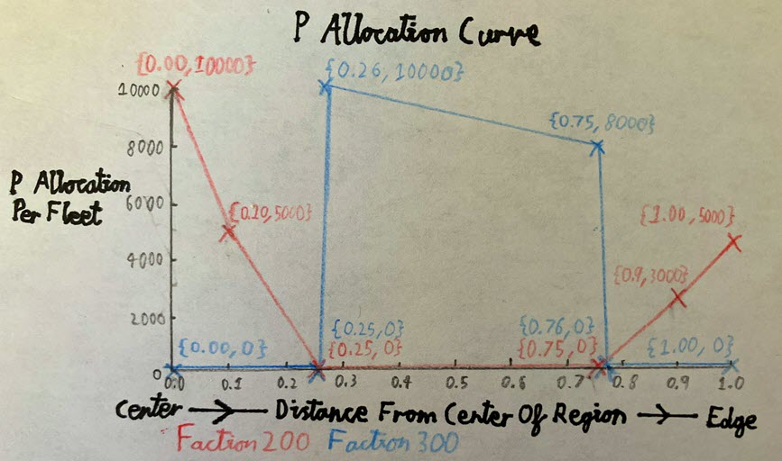
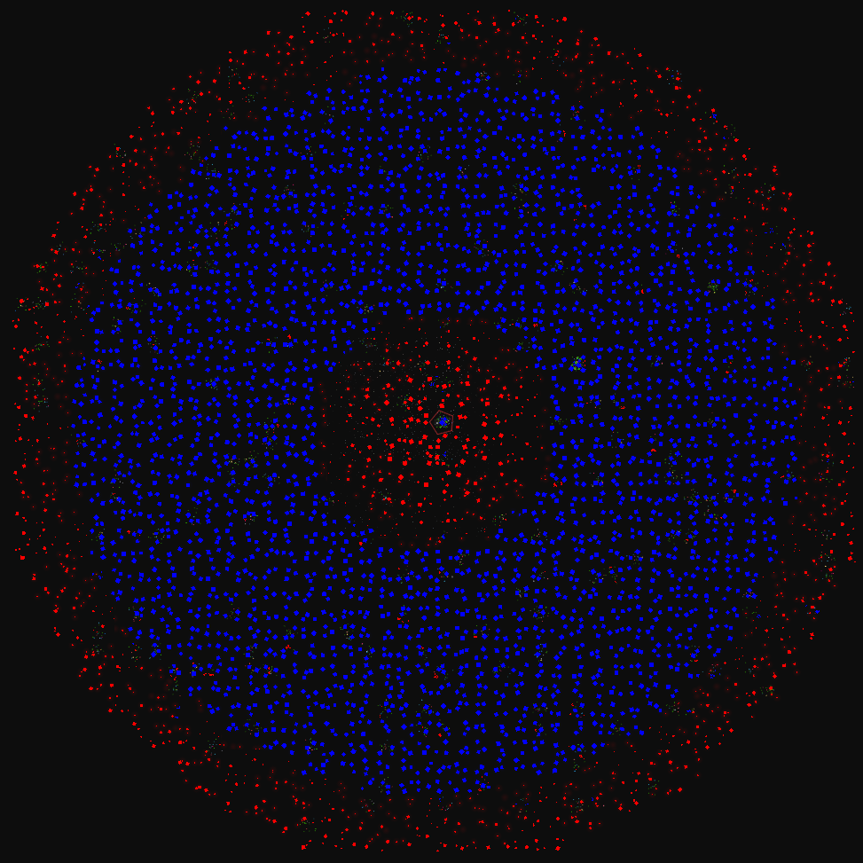

# Fleet Spawning
(Fleet spawning is surprisingly complex, but there has been so much misinformation and mods that have gone on to use fleet code "incorrectly", that even if you do not understand fleets at all, you probably won't even notice.)
<!-- `fleetFraction` is the probability of a sector in the region containing a fleet.

`fleets` controls how much P is allocated to a fleet of a faction in a sector at different distances from the center of a region.

`fleetCount` controls the ranges of ship counts for each faction of a fleet. -->
When a sector is generated in this region, it has `fleetFraction` (0.0-1.0) probability to spawn one type of fleet in from `fleets`.

`fleets` is a list of fleet types. Each fleet type in `fleets` has a faction ID and also has a list of number pairs that represent the total P of fleets at different locations in the region. The 2nd number of the number pair is a P allocation distributed in a  fleet, and the 1st number being which distance from the center of the region that P allocation is for.

In other words, `fleets` controls how much P is allocated to a fleet of a faction in a sector at different distances from the center of a region.

Also, each fleet type's list of P allocations should have a value at 0.0 distance and at 1.0 distance.

`fleetCount` is a list of ranges of ship numbers for the fleet type at the same index.

So, every time a fleet is spawned in a sector, a random number in the range of the relevant `fleetCount` element is chosen to decide how many ships will be in the fleet. Then, the relevant P allocation for the fleet (dependent on the sector's distance from the center of the region) is spread out between the number of ships in the fleet.
```lua
    fleets={
		{ 98    -- Faction ID of the faction that can spawn
				-- in a sector in this region.
			{
				-- Each faction 98 fleet in the center of the region has 10000P total.
				{0.0,10000}

				-- Each faction 98 fleet 1/4 from the center of the region
				-- has (10000+3000)/2=6500P total.

				-- Each faction 98 fleet halfway into the region has 3000P total.
				{0.5, 3000}

				-- Each faction 98 fleet 1/4 from the edge of the region
				-- has (3000+1000)/2=2000P total.

				-- Each faction 98 fleet at the edge of the region has 1000P total.
				{1.0, 1000}
			}
		}
		{ 8     -- The Terrans (faction 8) could also spawn in this region.
			{ 
				{0.0,    0}
				-- No Terrans can spawn anywhere from the center
				-- to 80% of the region. It will all be faction 98.
				{0.8,    0}

				-- Increasing from 80% to 100% of the region,
				-- Terran fleets can begin to spawn in sectors.
				{1.0, 1000}
				-- At the edge of the region, each fleet has a maximum of 1000P total.
			}
		}
    }

	fleetCount={
		{4,8}	-- Each faction 98 fleet has 4 to 8 ships.
		{10,16} -- Each Terran fleet has 10 to 16 ships.
	}

				-- Every sector in this region has a 75% chance of spawning a
				-- faction 98 fleet and a 75% of spawning a Terran fleet.
	fleetFraction=0.75
```
## Fleet P Allocation Example
Below is an example of a unique region that exploits the P allocation curve of 2 factions, where bigger ships have more P.
```lua
{
	fleets={
		{ 200 -- Red Colored Faction
			{
				{0.00,10000}
				{0.10, 5000}
				{0.25,    0}
				{0.75,    0}
				{0.90, 3000}
				{0.10, 5000}
			}
		}
		{ 300 -- Blue Colored Faction
			{
				{0.00,    0}
				{0.25,    0}
				{0.26,10000}
				{0.75, 8000}
				{0.76,    0}
				{0.10,    0}
			}
		}
	}
	fleetCount={
		{3,3}
		{3,3}
	}
	fleetFraction=1
	-- Other fields here.
}
```



This shows how versatile regions are, but a better way of doing this that would have the same effect would be to use [subregions](./subregions.md).