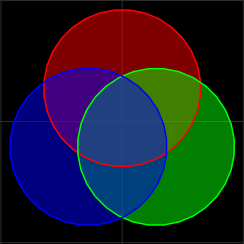
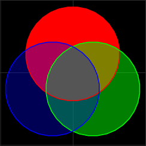
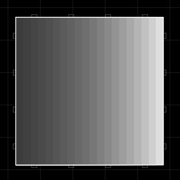
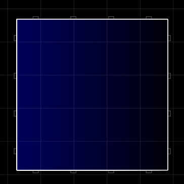
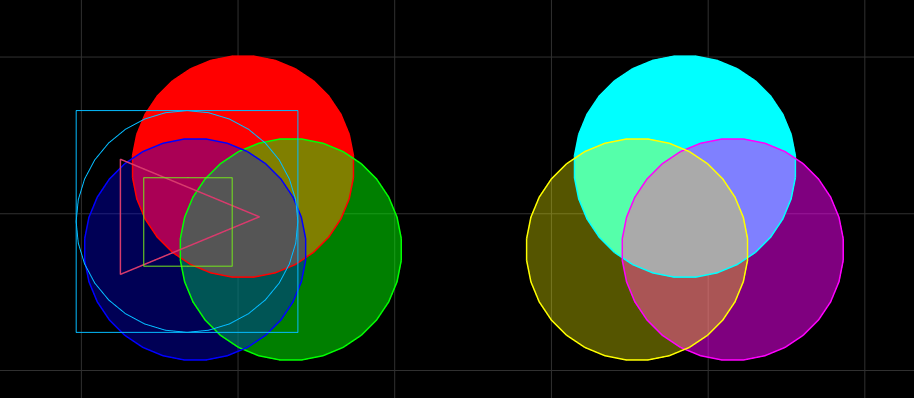

# Getting More Than Three Colors
As shrouds are limited to using the three colors of their block (`fillColor`, `fillColor1`, and `lineColor`), they can usually only have three colors, but there are ways to get around the limitations.
## Overlaying Transparent Shrouds
When shrouds with >100% alpha are overlayed, only the lines of the topmost shroud are rendered (unless the shrouds have the same Z level). However, the fill colors of all the shrouds are merged, which can be used to create more than three colors.

Below is an example of a shroud with 3 circles layered bottom up in the orders red, blue, and green, all with 50% alpha:
```lua
-- Shape 271390000 is a circle.
{ 17000
	features=INVISIBLE
	fillColor =0x7FFF0000
	fillColor1=0x7F00FF00
	lineColor =0x7F0000FF
	shroud={
		{ tri_color_id=0 tri_color1_id=0 line_color_id=0 shape=271390000 size={10.0,10.0} offset={2.500, 2.500,0.01} }
		{ tri_color_id=1 tri_color1_id=1 line_color_id=1 shape=271390000 size={10.0,10.0} offset={4.665,-1.250,0.01} }
		{ tri_color_id=2 tri_color1_id=2 line_color_id=2 shape=271390000 size={10.0,10.0} offset={0.335,-1.250,0.01} }
} }
```



Even though all the circles in the above example have the same Z level of `0.01`, and the same alpha value of 50%, the intersection of all three colors is mostly blue because of the digital compositing process.

The digital compositing process decides the color of the pixels of the intersection with this process:
1. The opaque black background defaults pixels to black: 0% red, blue, and green.
2. The black color is mixed with the red circle of 50% alpha. This leads to a color that is 50% black, and 50% red. In terms of RGB, this is 50% red, 0% blue, and 0% green.
3. Then, this dark red color is mixed with the green circle of 50% alpha. This creates a color that is 25% black, 25% red, and 50% green. In terms of RGB, this is 25% red, 50% green, and 0% blue (`0x3F7F00`).
4. Finally, this slightly dark impure green color is mixed with a 50% blue. This leads to a color that is 12.5% black, 12.5% red, 25% green, and 50% blue. In terms of RGB, this is 14.29% red, 28.57% green, and 57.14% blue, (`0x244992`) which is a dark blue color.

However, if you want a grey center from three circles colored red, green, and blue, you would need to make the final ratios after the digital compositing process of the three colors all equal.

To get a color of 1:1:1 R:G:B:
1. Start with a full red at 100% alpha.
2. Then split it equally with green using an alpha value of 50% for 50% red and 50% green.
3. And then split those two colors with the third color, blue, at 33% alpha to get equal ratio for all colors.

The alpha values in order are:
1. Red:     100%
2. Green:    50%
3. Blue:     33%
```lua
{ 17000
	features=INVISIBLE
	fillColor =0xFFFF0000
	fillColor1=0x7F00FF00
	lineColor =0x550000FF
	shroud={
		{ tri_color_id=0 tri_color1_id=0 line_color_id=0 shape=271390000 size={10.0,10.0} offset={2.500, 2.500,0.01} }
		{ tri_color_id=1 tri_color1_id=1 line_color_id=1 shape=271390000 size={10.0,10.0} offset={4.665,-1.250,0.01} }
		{ tri_color_id=2 tri_color1_id=2 line_color_id=2 shape=271390000 size={10.0,10.0} offset={0.335,-1.250,0.01} }
} }
```


Merging their colors is of course limited, but it is useful for creating gradients with a non-opaque shroud on top to get rid of the lines:
```lua
{ 17000
	scale=4
	fillColor =0xFFFFFFFF
	fillColor1=0xFFFFFFFF
	lineColor =0x11000000
	shroud={
		{ tri_color_id=2 tri_color1_id=2 line_color_id=1 shape=SQUARE size={2* 1,20} offset={-10,0,0.01} }
		{ tri_color_id=2 tri_color1_id=2 line_color_id=1 shape=SQUARE size={2* 2,20} offset={-10,0,0.01} }
		{ tri_color_id=2 tri_color1_id=2 line_color_id=1 shape=SQUARE size={2* 3,20} offset={-10,0,0.01} }
		{ tri_color_id=2 tri_color1_id=2 line_color_id=1 shape=SQUARE size={2* 4,20} offset={-10,0,0.01} }
		{ tri_color_id=2 tri_color1_id=2 line_color_id=1 shape=SQUARE size={2* 5,20} offset={-10,0,0.01} }
		{ tri_color_id=2 tri_color1_id=2 line_color_id=1 shape=SQUARE size={2* 6,20} offset={-10,0,0.01} }
		{ tri_color_id=2 tri_color1_id=2 line_color_id=1 shape=SQUARE size={2* 7,20} offset={-10,0,0.01} }
		{ tri_color_id=2 tri_color1_id=2 line_color_id=1 shape=SQUARE size={2* 8,20} offset={-10,0,0.01} }
		{ tri_color_id=2 tri_color1_id=2 line_color_id=1 shape=SQUARE size={2* 9,20} offset={-10,0,0.01} }
		{ tri_color_id=2 tri_color1_id=2 line_color_id=1 shape=SQUARE size={2*10,20} offset={-10,0,0.01} }
		{ tri_color_id=2 tri_color1_id=2 line_color_id=1 shape=SQUARE size={2*11,20} offset={-10,0,0.01} }
		{ tri_color_id=2 tri_color1_id=2 line_color_id=1 shape=SQUARE size={2*12,20} offset={-10,0,0.01} }
		{ tri_color_id=2 tri_color1_id=2 line_color_id=1 shape=SQUARE size={2*13,20} offset={-10,0,0.01} }
		{ tri_color_id=2 tri_color1_id=2 line_color_id=1 shape=SQUARE size={2*14,20} offset={-10,0,0.01} }
		{ tri_color_id=2 tri_color1_id=2 line_color_id=1 shape=SQUARE size={2*15,20} offset={-10,0,0.01} }
		{ tri_color_id=2 tri_color1_id=2 line_color_id=1 shape=SQUARE size={2*16,20} offset={-10,0,0.01} }
		{ tri_color_id=2 tri_color1_id=2 line_color_id=1 shape=SQUARE size={2*17,20} offset={-10,0,0.01} }
		{ tri_color_id=2 tri_color1_id=2 line_color_id=1 shape=SQUARE size={2*18,20} offset={-10,0,0.01} }
		{ tri_color_id=2 tri_color1_id=2 line_color_id=1 shape=SQUARE size={2*19,20} offset={-10,0,0.01} }
		{ tri_color_id=2 tri_color1_id=2 line_color_id=1 shape=SQUARE size={2*20,20} offset={-10,0,0.01} }
		
		{ tri_color_id=2 tri_color1_id=2 line_color_id=1 shape=SQUARE size={2*20,20} offset={-10,0,0.03} }
} }
```


They can also fade into the background:
```lua
{ 17000
	features=INVISIBLE
	scale=4
	fillColor =0xFFFFFFFF
	fillColor1=0xFFFFFFFF
	lineColor =0x050000FF
	shroud={
		{ tri_color_id=2 tri_color1_id=2 line_color_id=1 shape=SQUARE size={2* 1,20} offset={-10,0,0.01} }
		{ tri_color_id=2 tri_color1_id=2 line_color_id=1 shape=SQUARE size={2* 2,20} offset={-10,0,0.01} }
		{ tri_color_id=2 tri_color1_id=2 line_color_id=1 shape=SQUARE size={2* 3,20} offset={-10,0,0.01} }
		{ tri_color_id=2 tri_color1_id=2 line_color_id=1 shape=SQUARE size={2* 4,20} offset={-10,0,0.01} }
		{ tri_color_id=2 tri_color1_id=2 line_color_id=1 shape=SQUARE size={2* 5,20} offset={-10,0,0.01} }
		{ tri_color_id=2 tri_color1_id=2 line_color_id=1 shape=SQUARE size={2* 6,20} offset={-10,0,0.01} }
		{ tri_color_id=2 tri_color1_id=2 line_color_id=1 shape=SQUARE size={2* 7,20} offset={-10,0,0.01} }
		{ tri_color_id=2 tri_color1_id=2 line_color_id=1 shape=SQUARE size={2* 8,20} offset={-10,0,0.01} }
		{ tri_color_id=2 tri_color1_id=2 line_color_id=1 shape=SQUARE size={2* 9,20} offset={-10,0,0.01} }
		{ tri_color_id=2 tri_color1_id=2 line_color_id=1 shape=SQUARE size={2*10,20} offset={-10,0,0.01} }
		{ tri_color_id=2 tri_color1_id=2 line_color_id=1 shape=SQUARE size={2*11,20} offset={-10,0,0.01} }
		{ tri_color_id=2 tri_color1_id=2 line_color_id=1 shape=SQUARE size={2*12,20} offset={-10,0,0.01} }
		{ tri_color_id=2 tri_color1_id=2 line_color_id=1 shape=SQUARE size={2*13,20} offset={-10,0,0.01} }
		{ tri_color_id=2 tri_color1_id=2 line_color_id=1 shape=SQUARE size={2*14,20} offset={-10,0,0.01} }
		{ tri_color_id=2 tri_color1_id=2 line_color_id=1 shape=SQUARE size={2*15,20} offset={-10,0,0.01} }
		{ tri_color_id=2 tri_color1_id=2 line_color_id=1 shape=SQUARE size={2*16,20} offset={-10,0,0.01} }
		{ tri_color_id=2 tri_color1_id=2 line_color_id=1 shape=SQUARE size={2*17,20} offset={-10,0,0.01} }
		{ tri_color_id=2 tri_color1_id=2 line_color_id=1 shape=SQUARE size={2*18,20} offset={-10,0,0.01} }
		{ tri_color_id=2 tri_color1_id=2 line_color_id=1 shape=SQUARE size={2*19,20} offset={-10,0,0.01} }
		{ tri_color_id=2 tri_color1_id=2 line_color_id=1 shape=SQUARE size={2*20,20} offset={-10,0,0.01} }
		
		{ tri_color_id=2 tri_color1_id=2 line_color_id=1 shape=SQUARE size={2*20,20} offset={-10,0,0.03} }
} }
```


Sadly, there is no way to truly avoid rendering lines, as, when hiding lines, there must always be some higher-layered near-transparent shroud with its own rendered lines.
## Never Firing Non-Turreted Launcher
A non-turreted [never firing launcher](./always_and_never_firing_weapons.html?highlight=LAUNCHER|NEVERFIRE), can hold a launchable that can have its own three colors and its own shroud.

The following example has 6 different colors (blending together to make two grays) using a small custom launcher and launchable shape:
```lua
{ 17000
	features=COMMAND|GENERATOR|INVISIBLE|LAUNCHER|NEVERFIRE|NOICON
	shape=271390004
	fillColor =0xFFFF0000
	fillColor1=0x7F00FF00
	lineColor =0x550000FF
	aihint_range=0
    launcherPower=inf
	shroud={
		{ tri_color_id=0 tri_color1_id=0 line_color_id=0 shape=271390002 size={10.0,10.0} offset={2.500, 2.500,0.02} }
		{ tri_color_id=1 tri_color1_id=1 line_color_id=1 shape=271390002 size={10.0,10.0} offset={4.665,-1.250,0.02} }
		{ tri_color_id=2 tri_color1_id=2 line_color_id=2 shape=271390002 size={10.0,10.0} offset={0.335,-1.250,0.02} }
	}
	replicateBlock={
		shape=271390005
		fillColor =0xFF00FFFF
		fillColor1=0x7FFF00FF
		lineColor =0x55FFFF00
		shroud={
			{ tri_color_id=0 tri_color1_id=0 line_color_id=0 shape=271390002 size={10.0,10.0} offset={22.500, 2.500,0.02} }
			{ tri_color_id=1 tri_color1_id=1 line_color_id=1 shape=271390002 size={10.0,10.0} offset={24.665,-1.250,0.02} }
			{ tri_color_id=2 tri_color1_id=2 line_color_id=2 shape=271390002 size={10.0,10.0} offset={20.335,-1.250,0.02} }
		}
	}
}
```
