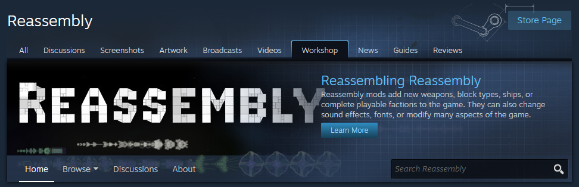
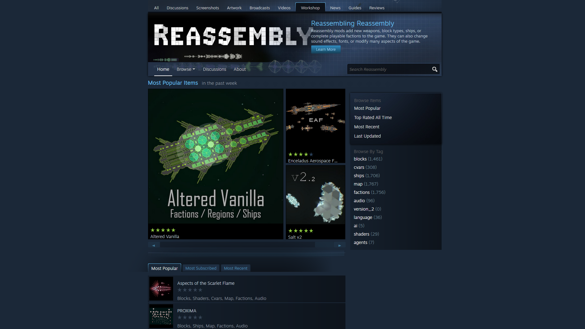
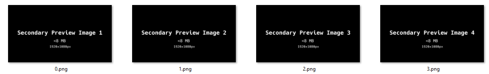
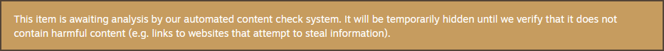

# Publishing to the Steam Workshop

Once your mod is in a state where you are happy to release it or when you are finished with it, you can prepare it for publication to the Steam Workshop.



To do this, you should create preview images that explain and show off your mod for people browsing the Steam Workshop.


## Adding `preview.png`
`preview.png` is the main picture of your mod and decides the first impressions that people will have when they first see your mod. It is located in the same place as `blocks.lua`.

```
Reassembly/
└── mods/
    └── My New Mod/
        ├── blocks.lua
        └── preview.png
        └── <other mod stuff here>
```

Key requirements:
 - Called `preview.png`, note the [`.png`](https://fileinfo.com/extension/png) file format.
 - In the right place (see above).
 - Less than 1 MB file size.

Recommended factors:
 - Square image so it looks correct.
 - Big, easy to read title. Try making it out of your faction's blocks.
 - Show off what makes your faction interesting. Put out your biggest, coolest ship for all the world to see.

I think that the `preview.png` I made for [Debaton](https://steamcommunity.com/sharedfiles/filedetails/?id=3295296698) is a good example:


Here is an example of how other `preview.png` look on the popular section of the Steam Workshop:



## Secondary Preview Images



Secondary preview images do not need to be in a mod's files and are uploaded directly into the Steam Workshop page.

Key requirements:
 - Less than 8 MB file size each.

Recommended factors:
 - Do not store these in your mod's folder so that they are not uploaded to the Steam Workshop and take up the storage space of whoever downloads it.
 - Show off your ships, your weapons, anything you could not fit in the `preview.png`.
 - Add text to explain things, such as faction gimmicks.

## Mod Description

Before you publish to the Steam Workshop, it is a good idea to prepare a mod description.

It could answer these questions:
 - What is this mod?
 - Does it have any gimmicks?
 - What makes it special?
 - How strong is this faction?
 - Does it have any interesting lore?
 - Who helped you make it?

## Publishing to the Steam Workshop

Navigate to the mod menu and click the 'publish' button.

<video controls>
  <source src="diagrams/publish_button.mp4" type="video/mp4">
  Your browser does not support the video tag.
</video>

Next, you will see a your mod's workshop page open with the following message, which can be ignored:



Now you can add your [secondary preview images](./publishing_to_the_steam_workshop.md#secondary-preview-images) and [mod description](./publishing_to_the_steam_workshop.md#description)

## Adding Secondary Preview Images

1. Add/edit images & videos.
2. Choose files.
3. Upload.
4. Manage images.
5. Save and Continue.

<video controls>
  <source src="./diagrams/adding_secondary_preview_images.mp4" type="video/mp4">
  Your browser does not support the video tag.
</video>

## Adding a Mod Description

If your mod requires any beta features, put it in `[CAPITAL]` text in the title so that nobody can miss it: `[BETA REQUIRED]`.

1. Edit title & description.
2. Description.
3. Title.
4. Save.

<video controls>
  <source src="./diagrams/adding_a_mod_description.mp4" type="video/mp4">
  Your browser does not support the video tag.
</video>

## Advertise your Mod

If you are not a part of it already, go to the Reassembly Discord server and tell everyone about your mod.

Reassembly Discord: <https://discord.gg/8fCjt3J>.