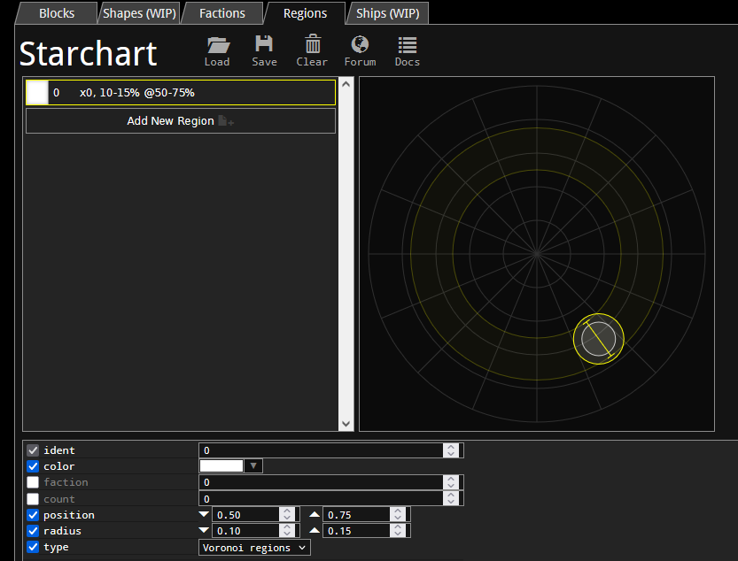

# regions.lua
`regions.lua` controls how sectors procedurally generate in the galaxy by defining regions.

Below is an example of a `regions.lua` that defines the region for one faction. Note that `regions.lua`s that define multiple regions have a [different syntax](./multiple_regions_in_one_mod.md).
```lua
{
	-- General region identity:
	ident=98                    -- Region ID should be same as group.
                                -- (Technically does not have to be,
                                -- but it is strongly recommended.)

	color=0x5555AA              -- Color on galaxy map.
    
	faction=98                  -- Faction of the region.
                                -- Region name is taken from the faction.
	
    -- Region Spawning:
	count=3                     -- Number of this region on the map.

	position={0.90,0.95}        -- Range of this region's position 0.0-1.0.
                                -- 0.0 is the center of the galaxy,
                                -- 1.0 is at the edge.

	radius=  {0.05,0.10}        -- Range of this region's size 0.0-1.0.
                                -- 0.0 could just not spawn the region,
                                -- 1.0 could make the region galaxy-sized.

	type=2                      -- Defines the region's shape.
                                -- 0: Voronoi - evenly spaced, recommended (bias:).
                                -- 1: Splats  - what the Reds use.
                                -- 2: Circles - what most factions use.
	
	-- *:
	fleets={
		{ 98 {
			{0,1000}
			{1,3000}
		} }
		{ 8 {
			{0,3000}
		} }
	}
	fleetCount={1,4}            -- Range of number of ships per fleet in each sector.
	fleetFraction=1.0           -- Probability that a fleet spawns
								-- in each sector 0.0-1.0.
	
	-- Fortresses (entities that surrounded damaged stations):
	fortress={
		"98_Fortress_1"
		"98_Fortress_2"
		"98_Fortress_3"
	}
	fortressCount={3, 6}         -- Range of fortresses per damaged station.
	fortressRadius={500, 500}    -- Range of distances of fortresses from station.
	
	-- **:
	unique={
		{
			"98_Special_Station"
		}
		{
			"98_Other_Thing_1"
			"98_Other_Thing_2"
		}
		{
			"8_interceptor"
		}
	}
	uniqueFraction=0.5          -- Probability that a unique fleet spawns
								-- in each sector 0.0-1.0.
	
	-- Asteroids:
	ambient={1,2}               -- List that decides what spawns on asteroids.
	                            -- 0: Nothing.
                                -- 1: Green plants.
                                -- 2: Blue plants.
                                -- 3: Pink plants.
                                -- Only -1: only faction structures.

	asteroidDensity={0.1,0.2}   -- Range of density of asteroids in region 0.0-1.0.
	asteroidSize={12,24}        -- Range of block count per asteroid.
	asteroidFlags=EXPLOSIVE     -- See all flags below.
}
```
\* [Fleet Spawning](./fleet_spawning.md)

\*\* [Unique Fleet Spawning](./unique_fleet_spawning.md)

## Asteroid Flags

Many asteroid flags sadly do not work (they can be found in ), but the ones that do are listed below:
 - `EXPLOSIVE`: asteroid blocks are replaced with their explosive variants.
 - `UNIFORM_SIZE`: all asteroids in a sector have the same number of blocks.

## Regions Visualizer

The [RWDK](https://ttftcuts.github.io/RWDK/)'s region editor is a useful tool for visualising how much of the galaxy a region will take up.

