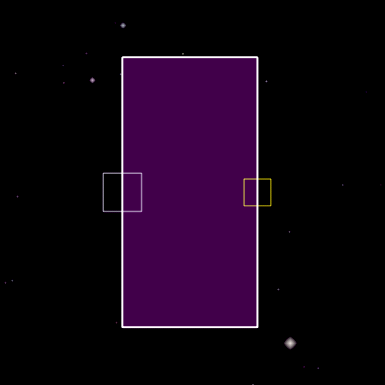
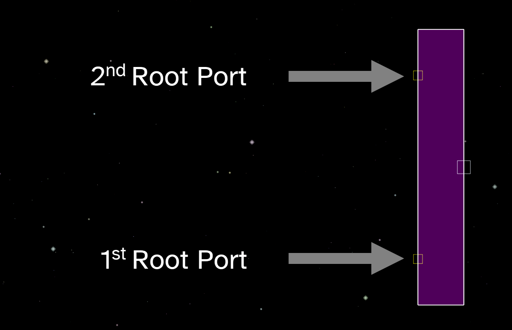
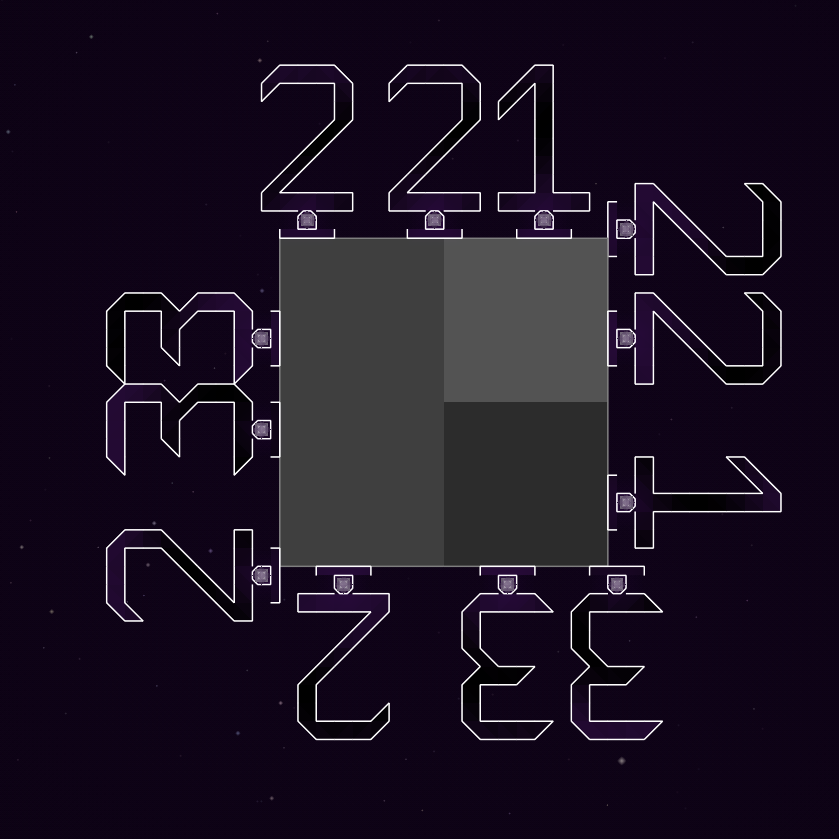
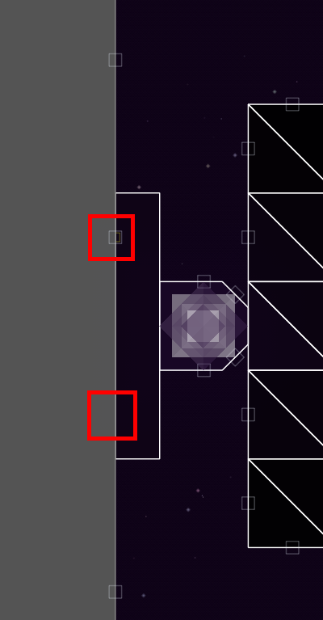

# Root Shapes

Root shapes are used for plants and [structures](./structures_on_asteroids.md) that can spawn, attach, and or grow on asteroids.

They are defined the same as normal shapes, but they must have a single port with the [`ROOT`](./port_flags.html?highlight=root) port flag.

The `ROOT` port must be the first in the list of ports. (This does not mean it must be on the first side.)

It does not matter which direction the root port faces. (The root port of vanilla [seeds](./vanilla_shapes.html?highlight=seed#plant) faces left while the root port of [`RECT_ROOT`](./vanilla_shapes.html?highlight=rect_root#root) faces right.)

```lua
{ 271390000 {
	{        
        verts={ {-2.5,-5} {-2.5,5} {2.5,5} {2.5,-5} }
        -- Root port must be the first.
        ports={ {2,1/2,ROOT} {0,1/2} {1,0,NONE} {3,0,NONE} }
	}
} }
```



## Multiple `ROOT` Ports

When a shape has multiple `ROOT` ports, only the one that is the first in `ports` is used.

Below is an example of a shape with two `ROOT` ports aligned to asteroid port spacing used on structures:

```lua
{ 271390000 {
	{        
        verts={ {-2.5,-15} {-2.5,15} {2.5,15} {2.5,-15} }
        ports={ {0,1/6,ROOT} {0,5/6,ROOT} {1,0,NONE} {3,0,NONE} {2,1/2} }
	}
} }
```



Only the first root port is used for spawning on asteroids. The second root port is often off the edge of the asteroid.



The second port does not connect to the alligned port of an asteroid. This behaviour persists after reloading a save. This may have no meaningful effect.

