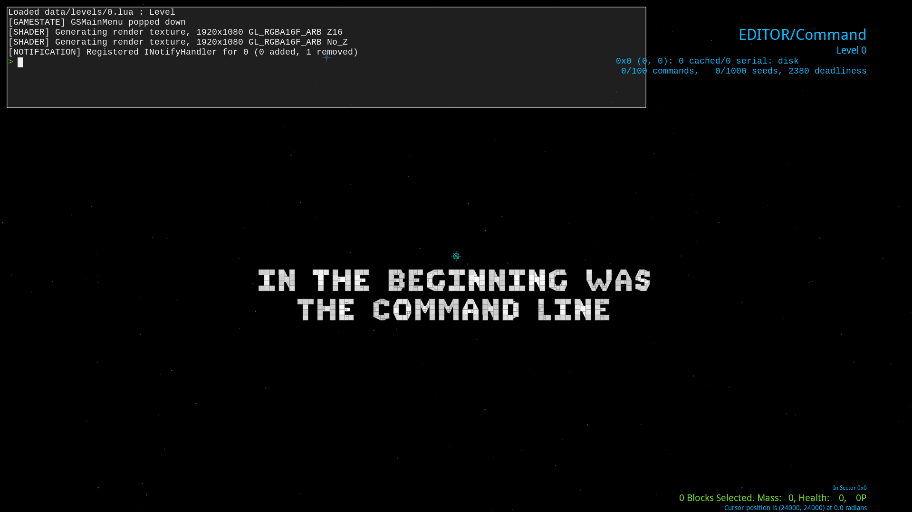
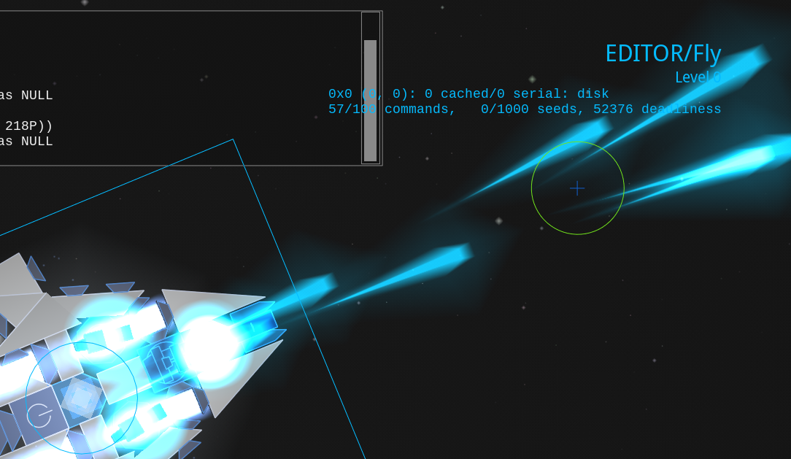
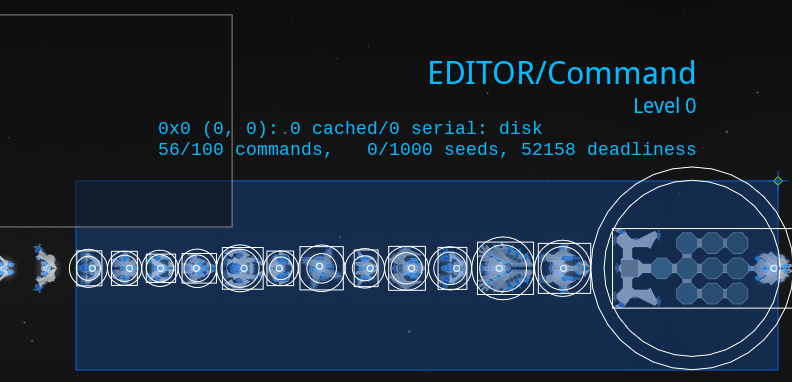
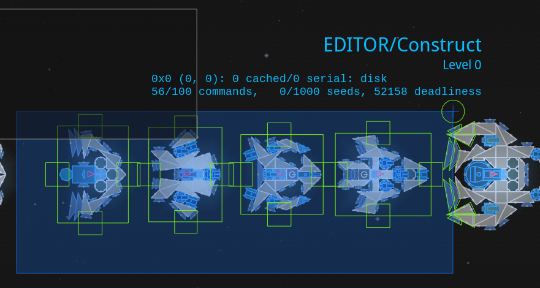
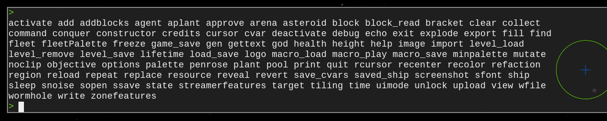
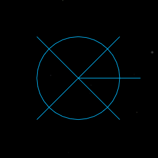

# Sandbox Basics

The sandbox is where a faction's blocks can be tested out and where ships can be built without anything annoying getting in the way.

## Sandbox Modes
There are 3 modes for interacting with the sandbox:
1. Fly: start controlling the selected ship.

    

2. Command: select ships and see how your ships will look in game.

    

3. Construct: interact with everything with the controls of the campaign's editor and look at the selected ship's construction info in the bottom right.

    

Switch between the modes by pressing the corresponding number keys without having your mouse cursor over the console. (`1` for fly, `2` for command, `3` for construct.)
## Interacting with the Console
Hovering your mouse over the console in the top left lets you type console commands.

Pressing `Tab` will either autocomplete what you are typing or list out what options you could type.

For example, pressing tab on an empty console will give you every command in a list:

Many commands do an action at the deploy location, the blue circle with an X. Change its location by double clicking.

Also, if you use the shortest distinct way of typing the command, the console will understand it. These abbreviations will be shown in brackets next to the full versions of commands.

## Spawning in Palettes
Each faction has a palette that can be spawned in using the `palette` (`pa`) command followed by either its [`group`](./blocks.lua.html?highlight=group) in the `blocks.lua` or its [`name`](./factions.lua.html?highlight=name) in the `factions.lua`.

You can also use the `minpalette` (`mi`) command to only spawn in one of each scale of block to keep your workspace small.

Work with the palette using normal editor controls by switching to command mode by pressing `3`.

<video height=256 controls>
  <source src="diagrams/sandbox_mi.mp4" type="video/mp4">
  Your browser does not support the video tag.
</video>

## Looking at Ships
The main use of the command mode other than selecting ships is to look at ships without the construct mode's visual clutter.

This is useful if you care about how lines are drawn or if you just want to see how your ships will look in game.

<video height=256 controls>
  <source src="diagrams/sandbox_looking_at_ships.mp4" type="video/mp4">
  Your browser does not support the video tag.
</video>

## Flying Ships
Duplicate your ship in construct mode (`3`) and then fly it around away from your construction area with fly mode (`1`).

<video height=256 controls>
  <source src="diagrams/sandbox_flying_ships.mp4" type="video/mp4">
  Your browser does not support the video tag.
</video>

(Always duplicate your ships before flying them so that they can always be saved in their latest state and so that they do not reassemble to a previous state if activated.)

## Saving Modded Ships
Once you have spawned in a palette and made a ship with a command, save it to your mod's `ships/` folder with the `ssave <Ship Name Here>` (`ss`) command. Note that you must use underscores instead of spaces.

<video height=256 controls>
  <source src="diagrams/sandbox_ss.mp4" type="video/mp4">
  Your browser does not support the video tag.
</video>

Note that if neither your ship has a corresponding faction defined in the `faction.lua` nor there is a preexisting `ships/` folder, your ship will instead be saved to `C:/Users/<your username here>/Saved Games/Reassembly/Data/ships/`.

## Exporting Ships
Another way of turning ships into files is by using the `export <Ship Name Here>` (`expo`) command. This sends the ship to your desktop, which is useful when exporting ships made with vanilla factions so that you do not have to search in the game files.
## Spawning Fleet Palettes
Spawn in a faction's fleets by using the `fleetpalette` (`fleetp`) command followed by either its [faction ID](./factions.lua.html?highlight=98) or its [`name`](./factions.lua.html?highlight=name) in the `factions.lua`.

<video height=256 controls>
  <source src="diagrams/sandbox_fleetp.mp4" type="video/mp4">
  Your browser does not support the video tag.
</video>

(`fleetpalette 0` spawns in plants, `fleetpalette -10` spawns in every faction except for the Contestants, and specifying any other negative faction ID spawns in every faction plus the Contestants.)
## Saving the Sandbox
Use `Ctrl` + `S` to save the state of the sandbox.

If you want a clean state for your sandbox a big block of text saying 'IN THE BEGINNING WAS THE COMMAND LINE', use the `cl` command to clear everything and the do `Ctrl` + `S`.
## Opening and Closing the Console
Use the `` ` `` or `~` buttons without the mouse cursor over the console to open and close the console view. Works everywhere and not just the sandbox (save for most menus).

Pressing `Esc` also closes the console view.
## Time Settings
Use `P` without the mouse cursor over the console to freeze and unfreeze time.

Use `O` in the same way to progress Reassembly's simulation by 1 update (can be held down).

Use `{` to speed up time by 50% and `}` to slow it down by 50% ([updates per second](./ups.md) remains constant).

Use the `deb fps` command to open the FPS debugger in the bottem left to check update rate and UPS.`