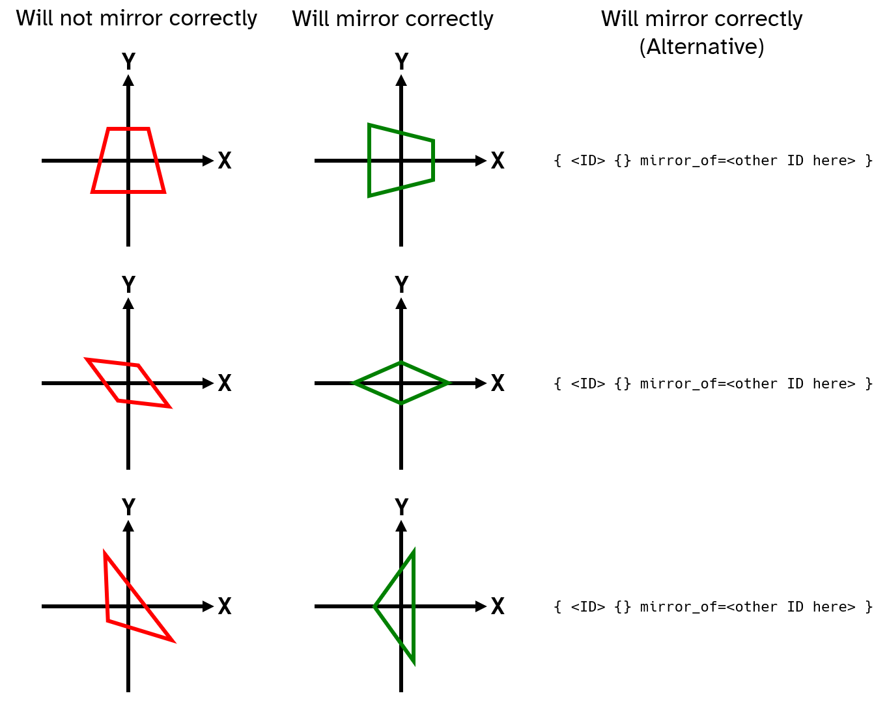

# Shapes: Further Essentials

This chapter contains information that is necessary for quality shapes.

# Shapes with Mirror Symmetry

Shapes with mirror symmetry should almost always have their line of symmetry along the X-axis.

If this is not the case, then the shape will not mirror correctly in the game and cause erroneous behaviour when building.

An alternative solution for shapes with mirror symmetry that do not have their line of symmetry along the X-axis is to make a [mirrored](./mirrored_shapes.md) varient of them, which is actually identical.



## Blocks That Should be Scalable

Different "tiers" of blocks, such as generators, weapons, shields, and other components may use different shapes. For example, a gun may have its first tier be a scale 2 `RECT`, its second tier a scale 1 `SQUARE`, and its third tier a scale 2 `RECT_LONG`.

To improve the mod's quality of life, these blocks should be scalable. Since blocks cannot scale between different shapes, a custom shape must be made which combines whatever shapes are required.

```lua
-- shapes.lua
{ 271390000 {
    { -- Scale 1 RECT
        verts={ {-5,-2.5} {-5,2.5} {5,2.5} {5,-2.5} }
        ports={ {0,1/2} {1,1/2} {2,1/2} {3,1/2} }
    }
    { -- Scale 1 SQUARE
        verts={ {-5,-5} {-5,5} {5,5} {5,-5} }
        ports={ {0,1/2} {1,1/2} {2,1/2} {3,1/2} }
    }
    { -- Scale 2 RECT_LONG
        verts={ {-10,-5} {-10,5} {10,5} {10,-5} }
        ports={ {0,1/2} {1,1/4} {1,3/4} {2,1/2} {3,1/4} {3,3/4} }
    }
} }
```

```lua
-- blocks.lua
{ 17000 name="Tiered Gun" blurb="Tier 1"
    group=98
    features=PALETTE|CANNON|TURRET
    shape=271390000
    cannon={
        -- Cannon fields here.
    }
}
{ 17001 extends=17000 blurb="Tier 2" scale=2 cannon={
    -- Cannon fields here.
} }
{ 17002 extends=17000 blurb="Tier 3" scale=3 cannon={
    -- Cannon fields here.
} }
```

<video height=256 controls>
  <source src="diagrams/blocks_that_should_be_scalable.mp4" type="video/mp4">
  Your browser does not support the video tag.
</video>

## Adding "Mirrored" Shapes for Asymmetric Blocks

Some blocks that use shapes with mirror symmetry may be asymmetric due to [shrouds](./shrouding.md), [frags](./fragments.md), or other features/fields.

To improve the mod's quality of life, the shape can be given a "mirrored" shape (that is mirrored in so far that Reassembly will let whatever block that uses the shape to be mirrored when building).

Below is an example of a shrouded block that can have its shroud mirrored:

```lua
-- shapes.lua
{ 271390000 {
    {
        verts={ {-5,-5} {-5,5} {5,5} {5,-5} }
        ports={ {0,1/2} {1,1/2} {2,1/2} {3,1/2} }
    }
} }
{ 271390001 {} mirror_of=271390000 }
```

```lua
-- blocks.lua
{ 17000
	group=98
	shape=271390000
	shroud={ { shape=RIGHT_TRI offset={2.5, 5,0} size={5, 5} } }
}
{ 17001
	extends=17000
	shape=271390001
	shroud={ { shape=RIGHT_TRI offset={2.5,-5,0} size={5,-5} } }
}
```

<video height=256 controls>
  <source src="diagrams/adding_mirrored_shapes_for_asymmetric_blocks.mp4" type="video/mp4">
  Your browser does not support the video tag.
</video>