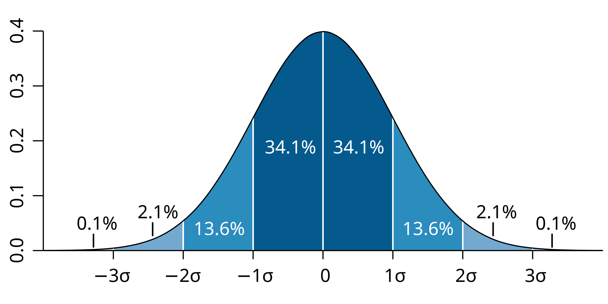

# Standard Deviation Fields

`StdDev` stands for 'standard deviation', In Reassembly modding, it is used for fields that add randomness to values.

The value you set as the standard deviation decides the maximum value that can be added and subtracted from the value it modifies.

Here is a standard deviation curve:

Every time a value is modified by its respective standard deviation value, a random value is taken between the `StdDev` value and the negative `StdDev` value. It is based on the standard deviation curve, so values close to 0 are less likely than values closer to the defined `StdDev` value.

Standard deviation fields are useful in fragments as they can make effects look less static and more alive.
