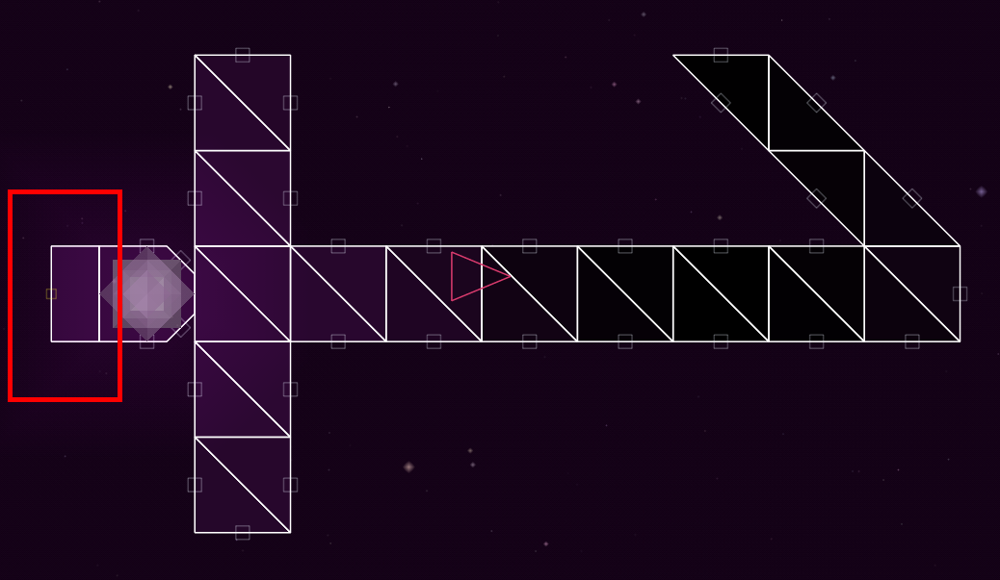
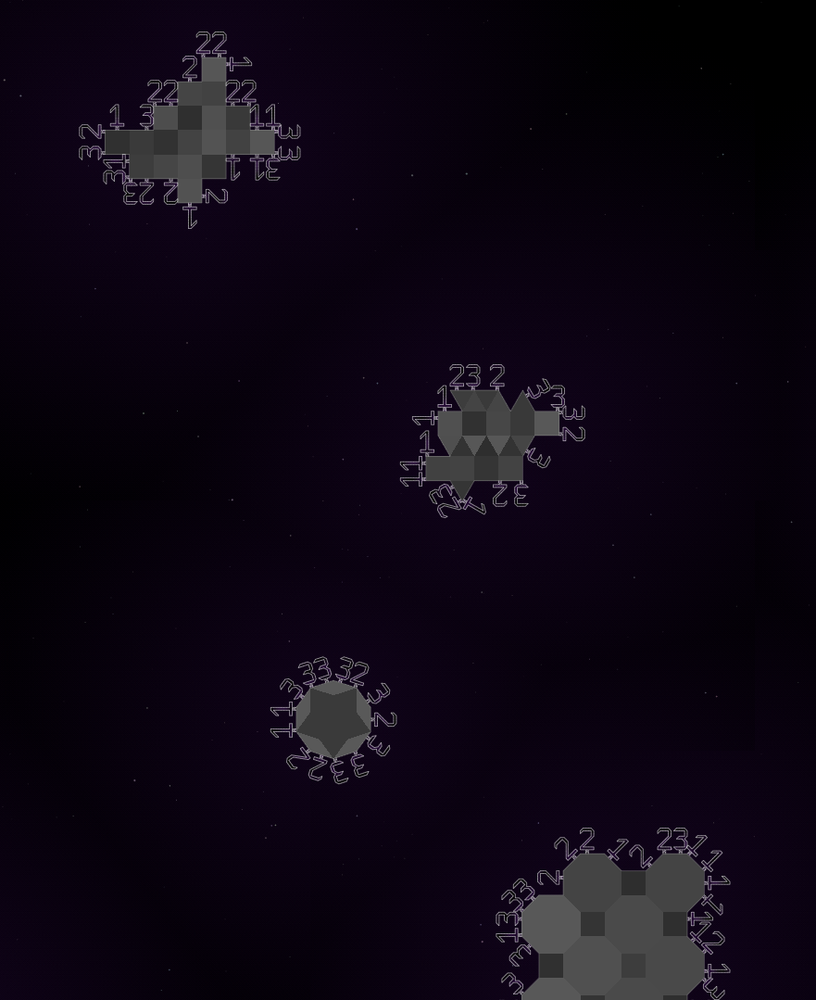
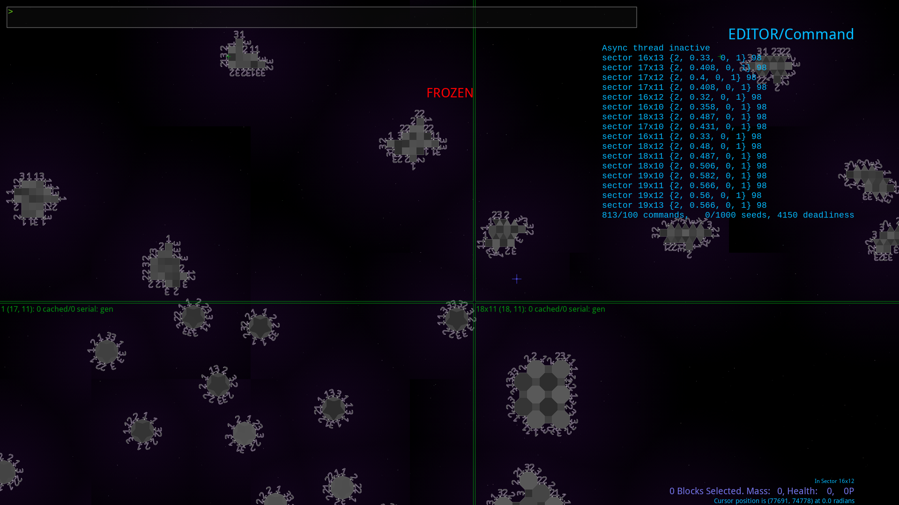

# Structures on Asteroids

Structures are ships without thrusters that can be spawned connected to asteroids in their faction's regions when a sector is generated.

They require a block both with [`features=ROOT`](./roots.md) and a [valid root shape](./root_shapes.md), such as `RECT_ROOT`. Its yellow port must be free (not connected to anything) and face the direction of the asteroid. See below:



In the `regions.lua`, the region that has structures requires `ambient={-1}`. It will then use structures of the faction with the faction ID of the `faction` field.

```lua
{
	ident=98
	faction=98

	ambient={-1} -- No other ambient types are allowed.

	asteroidDensity={0.2,0.2}
	asteroidSize={12,24}

    -- Other region fields here.
}
```

Create and save your structures as you would any other modded ship. They should be in the `ships/` folder.

```
Reassembly/
└── mods/
    └── Faction 98/
        ├── ships/
        │   ├── 98_Structure_1.lua
        │   ├── 98_Structure_2.lua
        │   └── 98_Structure_3.lua
        ├── blocks.lua
        └── factions.lua
        └── regions.lua
```

When you generate new sectors for the faction, you should find structures on every asteroid.



Note that there is no way of controlling asteroid shape usage.

