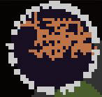

# Subregions
Each region can optionally have the `subregions` field, which is a list of other regions, each with its own unique `ident` as well as other fields.

Note that the `radius` and `position` fields of each subregion is relative to the parent region.
```lua
{
    ident=98

    color=0x5555AA
    faction=98

    count=3
    position={0.70,0.80}
    radius=  {0.05,0.10}

    subregions={ -- Ensure that each subregion has a unique ident.
        {
            ident=980

            color=0x8888AA
            faction=98

            count=1
            position=0.70
            radius=  0.30
            -- Other fields here.
        }
        {
            ident=981

            color=0xAAAA55
            faction=98

            count=3
            position=0.2
            radius=  0.1
            -- Other fields here.
        }
        {
            ident=982

            color=0x333388
            faction=98

            count=3
            position={0.00,1.00}
            radius=  {0.20,0.30}
            -- Other fields here.
        }
    }
}
```
Subregions can even contain other subregions, creating a region tree.
```lua
-- Many fields excluded.
{
    ident=980
    faction=98

    subregions={
        {
            ident=981
            faction=98
        }
        {
            ident=982
            faction=98

            subregions={
                {
                    ident=983
                    faction=98
                }
                {
                    ident=984
                    faction=98
                }
            }
        }
    }
}
```
## Example of a Unique Region
The [Makai & Monolith Orbital Runeworks](https://steamcommunity.com/sharedfiles/filedetails/?id=3373133163) mod uses nested subregions well by imitating the shape of its rune blocks with regions of different shapes.

(Fields that do not affect region map appearance have been removed.)
```lua
{
-- Deep Blue Background:
	ident=2671
	color=0x1E142B
	faction=267
	count=4
	type=2
	position={0.9,1.0}
	radius=  {0.2,0.2}
	subregions = {
-- Inner Light Orange Splats:
        {
            ident=2672
            color=0xEE915B
            faction=267
            count=2
            type=1
            position={0.2,0.6}
            radius=  {0.2,0.3}
        }
        {
-- White Outer Rim:
            ident=2673
            color=0xFFFFFF
            faction=267
            count=40
            type=2
            position={1.0,1.0}
            radius=  {0.1,0.1}
        }
    }
}
```
 