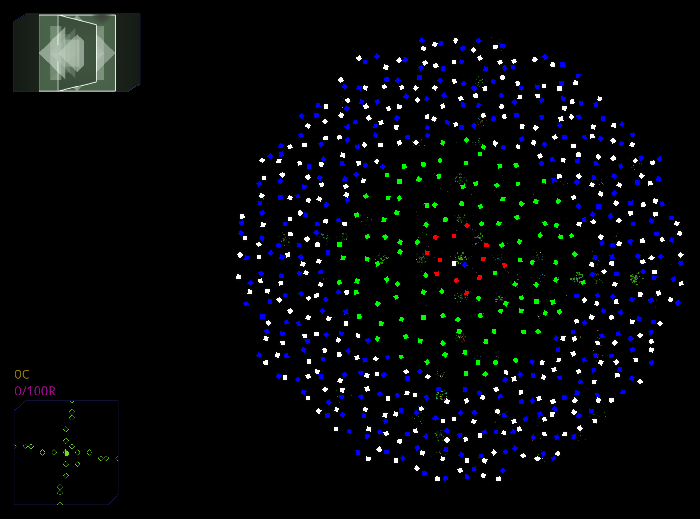

## Unique Fleet Spawning
Regions can contain special structures or ships that are unrelated to their fleets, fortresses or buildings: they are unique spawns.
```lua
	unique={           -- The unique field contains a list of unique fleets.
		{
			"200_2250" -- Red Faction
		}
		{
			"300_2250" -- Green Faction
		}
		{
			"400_2250" -- Blue Faction
			"500_2250" -- White Faction
		}
	}
	uniqueFraction=1.0
```
For each sector in a region, `uniqueFraction` is the probability that a unique fleet will spawn in it.

Each item in the `unique` field is a unique fleet, and each unique fleet is a list of ship names (ship names must be repeated to appear multiple times). Each unique fleet spawns all the ships in its ship list unless there is not enough space in the sector, which can be because of other ships, asteroids, or space debris/plants.

When a sector is chosen to contain a unique fleet, it will contain the unique fleet whose position in the `unique` list matches the sector's distance from the center of the region.

The galaxy image below uses the `unique` defined above to show how uniques are spawned based on their definition's position in the list.



The central sector contains the last defined unique fleet for some reason, even if it is not where the player spawns.
