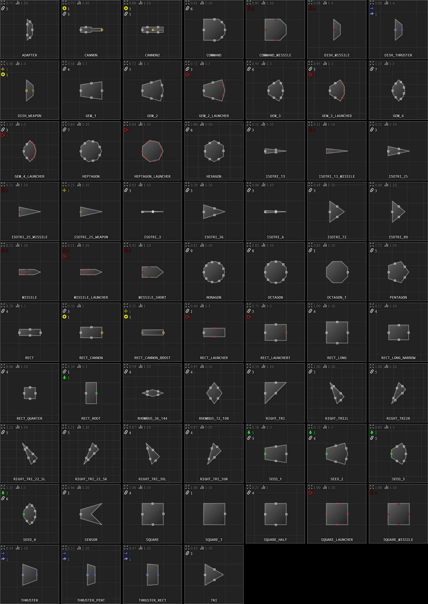

# Vanilla Shapes

This is a list of every vanilla shape (shape in the base game that every mod can use) with images sourced from the RWDK.

```lua
{ 17000
    shape=SQUARE
}
{ 17001
    shape=DISH_THRUSTER
}
{ 17002
    shape=RIGHT_TRI2L
}
{ 17003
    shape=RIGHT_TRI2R
}
```

## Alphabetical

See just this image [here]<./diagrams/vanilla_shapes.png>.



## Grid

 - `SQUARE`: normal square; 1x1, 2x2, 3x3...
 - `SQUARE_1`
 - `COMMAND`
 - `SQUARE_HALF`
 - `RECT`: normal rectangle.
 - `RECT_LONG`: 1x1, 1x2, 1x3... (Tinkrell)
 - `RECT_LONG_NARROW`
 - `RECT_QUARTER`
 - `RIGHT_TRI`: 1x1 triangle.
 - `RIGHT_TRI2L`: 1x2 triangle (left).
 - `RIGHT_TRI2R`: 1x2 triangle (right).
 - `ADAPTER`
 - `OCTAGON`
 - `RIGHT_TRI_22_5L`: Bee long triangle (left).
 - `RIGHT_TRI_22_5R`: Bee long triangle (right).

## Hex

 - `HEXAGON`
 - `TRI`

## Penrose

The rhombuses of the Penrose shape palette can be described by the ratio of their two different angles.

 - `RHOMBUS_36_144`: 1:4rhom.
 - `RHOMBUS_72_108`: 2:3rhom.
 - `PENTAGON`
 - `ISOTRI_36`
 - `ISOTRI_72`

## Isosceles Triangles

 - `ISOTRI_3`
 - `ISOTRI_6`
 - `ISOTRI_13`
 - `ISOTRI_25`
 - `ISOTRI_36`
 - `ISOTRI_72`
 - `ISOTRI_80`

## Regular Polygons

 - `TRI`
 - `SQUARE`
 - `PENTAGON`
 - `HEXAGON`
 - `HEPTAGON`
 - `OCTAGON`
 - `OCTAGON_1`
 - `NONAGON`

 ## Thrusters

 - `DISH_THRUSTER`
 - `THRUSTER`
 - `THRUSTER_PENT`
 - `THRUSTER_RECT`

## Spinal Weapons

 - `CANNON`
 - `CANNON2`
 - `RECT_CANNON`

### Cannon Boosters

 - `DISH_WEAPON`
 - `ISOTRI_25_WEAPON`
 - `RECT_CANNON_BOOST`

## Launchers

 - `RECT_LAUNCHER`: two launcher ports between left and right sides.
 - `RECT_LAUNCHER1`: launcher port on front side.
 - `SQUARE_LAUNCHER`
 - `GEM_2_LAUNCHER`
 - `GEM_3_LAUNCHER`
 - `GEM_4_LAUNCHER`
 - `HEPTAGON_LAUNCHER`

## Launchables

 - `MISSILE`
 - `MISSILE_SHORT`
 - `DISH_MISSILE`
 - `SQUARE_MISSILE`
 - `COMMAND_MISSILE`
 - `ISOTRI_13_MISSILE`
 - `ISOTRI_25_MISSILE`
 - `MISSILE_LAUNCHER`: missile port on back side, two launcher ports between left and right sides.

## Roots

 - `RECT_ROOT`

## Plants

 - `GEM_1`
 - `GEM_2`
 - `GEM_3`
 - `GEM_4`

## Seeds

 - `SEED_1`
 - `SEED_2`
 - `SEED_3`
 - `SEED_4`

 ## Other

 - `SENSOR`